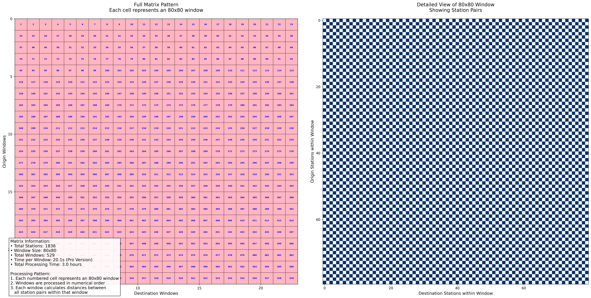

# Bike Station Distance Analysis

This project analyzes and compares two types of distances between bike stations:
1. Network distances (using GraphHopper API) - actual biking route distances
2. Geodesic distances (using geopy) - straight-line distances

## Quick Start

1. Install dependencies:

pip install -r requirements.txt


2. Add your GraphHopper API key to `.env`:
```
GRAPHHOPPER_API_KEY=your_api_key_here
```

3. Run the analysis:
```bash
python src/bike_station_distances.py
python src/calculate_geodesic_distances.py
python src/analyze_distances.py
```

## Project Structure

```
.
├── data/                  # Station data and generated distance files
│   ├── stations.csv      # Input station data
│   ├── graphhopper_distance.csv  # Network distances
│   └── geopy_distance.csv        # Geodesic distances
├── src/                  # Analysis scripts
├── result/               # Output visualizations and analysis
│   ├── matrix_detailed_view.png      # Distance matrix visualization
│   └── analysis_results/             # Detailed analysis outputs
└── requirements.txt      # Python dependencies
```

## Dataset Information

This project uses Citibike station data from June 2023. The dataset includes:
- Station locations (latitude/longitude)
- Station IDs and names
- Station status information
- Data source: [Citibike System Data](https://citibikenyc.com/system-data)
## GraphHopper API Configuration

### API Access
- Subscription Plan: Pro
- API Base URL: https://graphhopper.com
- Authentication: API key required (set in .env file)

### Rate Limits & Quotas
- Rate Limit: 1 request per 20 seconds
- Matrix Size Limit: 80x80 per request
- Daily Request Limit: Varies by subscription plan
- Vehicle Type: bike (optimized for cycling routes)


The following visualization shows how we collect the shortest network distance matrix between bike stations using the GraphHopper API:



## Dependencies

- Python 3.7+
- pandas
- numpy
- scipy
- matplotlib
- seaborn
- geopy
- requests
- python-dotenv

## Error Handling

The script includes comprehensive error handling for:
- File reading errors
- API request failures
- Missing API key
- Data processing errors

## Notes

- The GraphHopper API has daily usage limits, so the network distance calculation may take some time


